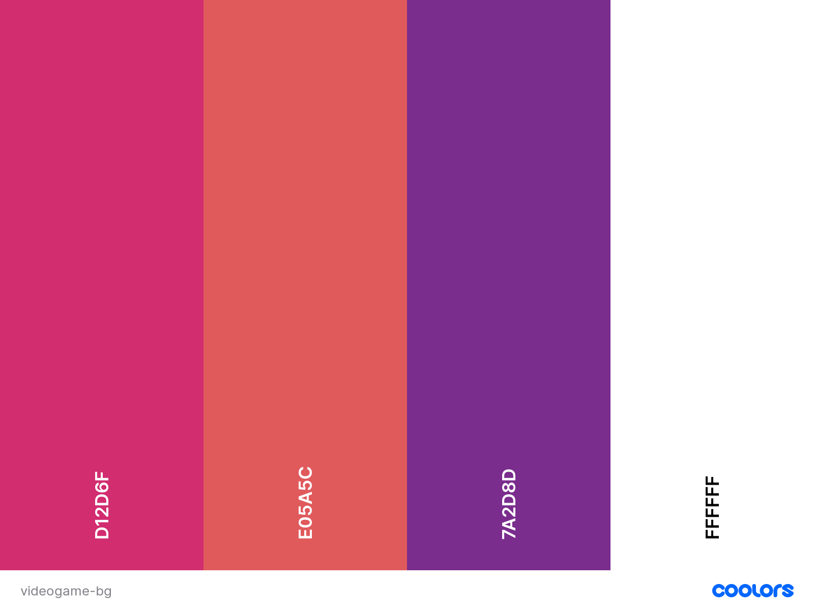

# Video Game Quizzes

## **Goal for this project** 

Welcome to Video Game Quizzes !

Are you a videogamer and you looking to test your gaming knowledge ?
So let's get started and have fun!

Thank you for visiting my project!
If you have any feedback or questions, head over to my GitHub contact details and feel free to reach out to me.

---

## Table of contents
* [UX](#ux)
    * [User Goals](#user-goals)
    * [User Stories](#user-stories)
    * [Site Owners Goals](#site-owners-goals)
    * [User Requirements and Expectations](#user-requirements-and-expectations)
        * [Requirements](#requirements)
        * [Expectations](#expectations)
    * [Design Choices](#design-choices)
        * [Fonts](#fonts)
        * [Colors](#colors)
        * [Structure](#structure)
* [Wireframes](#wireframes)
* [Features](#features)
    * [Existing Features](#existing-features)
    * [Features to be implemented](#features-to-be-implemented)
* [Technologies used](#technologies-used)
    * [Languages](#languages)
    * [Libraries and Frameworks](#libraries-and-frameworks)
    * [Tools](#tools)
* [Testing](#testing)
* [Deployment](#deployment)
* [Credits](#credits)
* [Closing Note](#closing-note)

## **UX**

### **User Goals**

* The game has to be repsonsive for all the devices sizes like tablets, phones and desktops
* Display feedback for correct/incorrect answers
* Display a visual progress bar to track user's progress through the questions
* During the game track the number of questions 
* Visual appealing website

[Back to Top](#table-of-contents)

### **User Stories**
* As a user, I would like to know the rules of the game before playing.
* As a user, I would like to know how many time left I have to answer the question.
* As a user, I would like to know the correct answer when answered incorrectly.
* As a user, I expect that the game has a nice visually appealing lay out to be in line with the game.
* As a user, I expect a variety of questions so no questions get repeated.
* As a user, I would like to learn new things about Videogames while I'm playing the game.
* As a user, I want to know where I am in the game, to know how many questions I still have left.
* As a user, I want to be able to restart the game once is over.
* As a user, I want to be able to save my score.
* As a user, I would like to compare my score whit other players.

### **Site owners Goals**
* To have an appealing website where users want to go to Test their Videogame knowledge.
* For the users to have fun while playing my game.

[Back to Top](#table-of-contents)

### **User Requirements and Expectations**

#### Requirements
* Easy to navigate 
* Appealing homepage
* Easy way to understand game rules and start the game
* Validate the correct answer
* Store the score of the user playing

#### Expectations
* Show which number of the questions user is in
* To let the user know if their answer was correct or wrong
* Show correct answer when answered incorrectly
* To show the final result after playing
* Show a personalised message with funny iamge after completing the game 

[Back to Top](#table-of-contents)

### **Design Choices**

I have used [Coolors](https://coolors.co/ "Coolors.co") to create a color scheme that matches the atmosphere of playing Fortnite Game.
The design choosed is simple but I would like to create cool and animated background.

#### Fonts
I have visited [Google Fonts](https://fonts.google.com/ "Google Fonts") to explore the various options.
For the title of my game, I have used the font [Source Code Pro](https://fonts.google.com/specimen/Source+Code+Pro?preview.text_type=custom). 

#### Colors

I have decide to use some colors that reminds the background image used.

* Color #D12D6F is used for some buttons, progression bar and the endgame container.
* Color #E05A5C is used for main game box container.
* Colot #7A2D8D is used for the 4 possible answers to the questions.
* Colot #fff is used for all the text and headings. 

[Back to Top](#table-of-contents)

## **Wireframes**

For the wireframes design I decide to use [Balsamic](https://balsamiq.com/wireframes/). First I created a basic wireframe for mobile and after I created the one for desktop and tablet.

Below you can find my wireframes:

### Mobile Wireframes
* [Homepage](wireframes/mobile-wireframe.jpg)

### Tablet Wireframes
* [Homepage](wireframes/tablet-wireframe.jpg)

### Desktop Wireframes
* [Homepage](wireframes/desktop-wireframe.jpg)

[Back to Top](#table-of-contents)

---

## **Features**

### **Existing Features**

* Use of [open Trivia API](https://opentdb.com/) 
* Answer validation
* Feedback provided if answer is incorrect
* Questions progression 
* Timer countdown for each question
* Score update while user is playing
* Personal message when game is over depending on the   final score
* User score can be saved in local storage 
* Leaderboard with top 5 scores

### **Features to be implemented**
* Database to proper save and render user scores
* Add different images for each questions
* Implement difficulty to be choosen by users

[Back to Top](#table-of-contents)

## **Technologies used**

### **Languages**

* [HTML](https://en.wikipedia.org/wiki/HTML)
* [CSS](https://en.wikipedia.org/wiki/Cascading_Style_Sheets)
* [JavaScript](https://en.wikipedia.org/wiki/JavaScript)

### **Libraries and Frameworks**

* [Font Awesome](https://fontawesome.com/)
* [Bootstrap](https://getbootstrap.com/)
* [Google Fonts](https://fonts.google.com/)
* [Particle.js](https://vincentgarreau.com/particles.js/)

### **Tools**
* [GitPod](https://www.gitpod.io/)
* [Balsamic](https://balsamiq.com/wireframes/)
* [W3C HTML Validator](https://validator.w3.org/) 
* [W3C CSS Validator](https://jigsaw.w3.org/css-validator/)
* [Open Trivia Database](https://opentdb.com/)

[Back to Top](#table-of-contents)

## **Testing**
---

## Game Rules
#### User story: As a user, I would like to know the rules of the game before playing.

* **Plan**  
After the page is loaded, the user should have the option to click a button 'Quiz Rules' when they can read more about rules in place for this game.

* **Implementation**  
Adding an extra button when page is loaded with 'Quiz Rules' that triggers a container. In the container there 5 rules in place written and another button that says OK . 
When the  button Ok is clicked the container is closed and return to main page where user can start the game or reade rules once more.

* **Test**  
The container have been tested on various browsers and devices. Only when the user clicks the OK button will be able to go back to the main page and start the game.

* **Result**  
Container works as planned and makes overall user experience much better.

* **Verdict**  
Test passed all the criteria and works as planned.

## Timer
#### User story: As a user, I would like to know how many time left I have to answer the question.

* **Plan**  
When the game starts, user should be able to see a countdown timer that tells how many seconds left they have to answer the question. When gets to nexts question timer reset.

* **Implementation**  
Adding a function in app.js, the function startTime() execute as soon as the user get the question. The setInterval() method in Javascript calls a function or evaluates an expression after the specified number of milliseconds (in my case 1000), and time decrementing.

* **Test**  
I tested the timer by playing the game from first to last question to make sure it works as planned. During the first test I discovered that timer didn't restart when user answer was correct, and I realized that I didn't pass clearInterval() and startTime() inside setTimeout when validating user selected answer.

* **Result**  
Timer works as planned across various devices and browsers.

* **Verdict**  
The test has passed all the criteria and works like planned.

## Answer validation 
#### User story: As a user, I would like to know the correct answer when answered incorrectly.

* **Plan** 
When user select correct answer, the choice should highlight in a shine green color. In the other hand when answer in incorrect, the choice should highlight in red color.

* **Implementation**  
Adding a function in app.js which validates user answer and add classes in order to highlight relevant choice. I added a setTimeout function to make sure that user has sufficient time to see if the asnwer is correct or not.

* **Test**  
I tested the answer validation across various devices and browers to make sure it works as planned. When testing on mobile scrren I realized that the higlighted choices size was too small and a gap was visible, I had to resize the classes correct and incorrect to fix it.

* **Result**  
Answer validation is working as expected and is more user friendly due to the full game being displayed on the screen on small devices.

* **Verdict**  
The test has passed all the criteria and works like planned.

## Question Counter
#### User story: As a user, I want to know where I am in the game, to know how many questions I still have left.

* **Plan** 
The original plan was to have question counter display with numbers underneath the 4 question to the left side. After the firt testing I decide to change it with a progress bar which updates every next questions and shows what percentages user is on the game. The reason for this change is that it looks better in terms of user experience.

* **Implementation**  
I added to extra div in index.html, one it works ad a container and the other shows progress bar when user goes to next question. There is an innerHTML which add  width in the nexQuestion function. The percentage is than calculate to show the current position. The progress bar starts at 0% and it moves 10% up for each question.

* **Test**  
I have tested the progress bar across different devices and browers to make sure it works accordingly. Progress bar is reacts responsive and for me it has a better result for user experience.

* **Result**  
Progress bar works as planned across various devices and browsers.

* **Verdict**  
The test has passed all the criteria and works like planned.

## Play Again
#### User story: As a user, I want to be able to restart the game once is over.

* **Plan** 
When the game is over an end message is displayed with the  score user got. I want to show different option to the user and one of this option is to click a button to play the game again so that if is clicked will take the user to the home page.

* **Implementation**  
Displayed a button in the end message container, added an event listener in JavaScript to trigger the button when is clicked to take back the user to the home page. On the home page user cna than click 'play quiz' to restart the game.

* **Test**  
I have tested on various devices to make sure it works as expected, on mobile at the first test the play agian button was to close to other buttons and it wasn't easy for the user to spot. I added more margin and also give a different color.

* **Result**  
Play again button works as planned across various devices and browsers.

* **Verdict**  
The test has passed all the criteria and works like planned.

## Save Score
#### User story: As a user, I want to be able to save my score.

* **Plan** 
Once the game is over user will see end game message with a personalised message depending on the final score that the user got. After the score results I want the user to be able to see 'save your score' message with an input and underneath then input, a Save button.

* **Implementation**
Displayed a button 'Save' with the input where user can type is name, the button is disabled until user start to type in, this is achieved adding 'keyup' enent in Javascript. In app.js I then added push object to array in order to store more than one user score and sort method to show scores from highest to lowest. I used localStorage setItem method to  update that key's value.

* **Test**  
I have tested on various devices to make sure it works as expected, I discovered that the score number was dispalyed as null value, I realized that I didn't pass correct properties to the score object, to fix it I passed mostRecentScore to it.

* **Result**  
Save score button works as planned across various devices and browsers.

* **Verdict**  
The test has passed all the criteria and works like planned.

[Back to Top](#table-of-contents)

## **Bugs**
---

Timer countdown doesn't restart

* **Bug**  
When you click on answer it shows feedback and go to the next question, the timer doesn't restart at 15 but continue the countdown left at the previous question.

* **Fix**   
At the end of the conditional statment inside validateUserAnswer I had to pass clearInterval(counter) and the startTime() function in order to reset timer for each question.

* **Verdict**  
When answer a question getnextquestion is activated and timer restart at 15 seconds as planned. Bug resolved. 

Questions repeat when play again

* **Bug**  
After finish the game and play again button is clicked I get the same question from previous game.

* **Fix**   
At the end of playAgain event i added Location reload() method in order to reload the current document.

* **Verdict**  
When I finish the game and click on Play Again button I get new questions as the page is reloading. Bug resolved.

Question and answer showing with double quotes and other unwanted characters
* **Bug**  
When fetching questions from the API it returns with % sign and &.

* **Fix**  
Updated the innerText to innerHTML in game.js

* **Verdict**  
Questions are now showing nicely as expected. Bug fixed.

[Back to Top](#table-of-contents)

## **Deployment**
---
